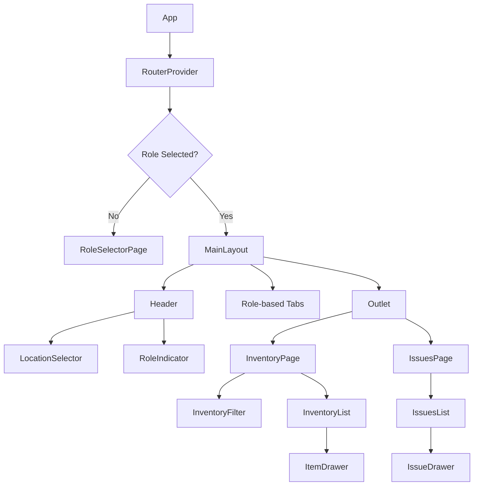
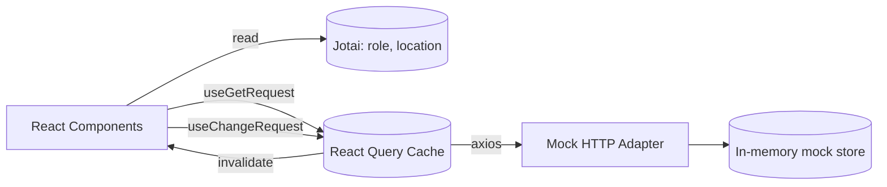

# Design Document

## Overview

The Weapon Inventory & Issue Management System is a role-based Single Page Application (SPA) built as a React 18 + TypeScript + Vite PWA. It provides two distinct workflows scoped by a selected location:

- **Rabashatz_User** (רבש״ץ): browses inventory, reports issues on items, and coordinates technicians.
- **Technician_User**: reviews issues assigned to locations and marks them resolved.

The initial phase uses in-memory mock data (no backend). The UI is driven by a drawer-based pattern for detail + actions, a top-bar header for role/location context, and MUI components with RTL support. State is split between Jotai atoms (role, location, navigation UI state) and TanStack Query (mock "server" state for inventory and issues), aligning with the workspace tech stack.

### Key Design Decisions

- **Jotai for session-scoped state (role, location)**: lightweight, avoids provider hell, survives route changes without `useEffect` plumbing.
- **TanStack Query for inventory/issues even against mock data**: lets the mock layer be swapped for a real HTTP client later with zero component changes.
- **Axios instance + mock adapter for the data layer**: the request/response shape is fixed now so the UI will not change when a real backend arrives.
- **Centralized `Status_Color_Map`**: a single source of truth satisfies Requirements 10, prevents color drift across screens, and makes theme changes trivial.
- **Drawer pattern (MUI `Drawer`) for Item and Issue details**: keeps list context visible, works well on both desktop and mobile (full-width on small breakpoints).
- **No `useEffect`, no `localStorage`**: per steering rules. Role is persisted only via a Jotai atom in memory for this phase; a later phase can add a persisted atom if needed.

## Architecture

### High-Level Component Tree



### Data Flow



### Project Layout

Following the `structure.md` feature-module pattern:

```
src/
├── features/
│   ├── shared/
│   │   ├── components/    # Drawer, EmptyState, StatusChip, SuccessPopup
│   │   ├── hooks/         # useGetRequest, useChangeRequest
│   │   ├── models/        # TId, TLocation, TStatusColor
│   │   ├── stores/        # roleAtom, locationAtom
│   │   └── utils/         # formatDate, statusColorMap
│   ├── role/
│   │   ├── pages/         # RoleSelectorPage
│   │   └── components/    # RoleButton
│   ├── inventory/
│   │   ├── pages/         # InventoryPage
│   │   ├── components/    # InventoryFilter, InventoryList, InventoryRow, ItemDrawer, ReportIssueForm
│   │   ├── hooks/         # useInventory, useReportIssue
│   │   └── models/        # IInventoryItem, TItemStatus, TItemType
│   └── issues/
│       ├── pages/         # IssuesPage (renders variant by role)
│       ├── components/    # IssuesList, IssueRow, IssueDrawer, CoordinateAction, ResolveAction
│       ├── hooks/         # useIssues, useCoordinateIssue, useResolveIssue
│       └── models/        # IIssue, TIssueStatus, TIssueType
├── providers/             # QueryClientProvider, JotaiProvider, ThemeProvider (RTL)
├── router/                # route definitions (lazy)
└── styles/                # tokens, RTL setup
```

## Components and Interfaces

### Shared Components

**`StatusChip`** — renders status text and its color from `Status_Color_Map`.

```ts
interface IStatusChipProps {
  status: TItemStatus | TIssueStatus;
}
```

**`EmptyState`** — shows "לא נמצאו נתונים" when a list is empty (Req 3.4, 6.3, 8.3).

```ts
interface IEmptyStateProps {
  message?: string;
}
```

**`AppDrawer`** — MUI `Drawer` wrapper with close control and RTL-aware anchor.

```ts
interface IAppDrawerProps {
  open: boolean;
  onClose: () => void;
  title: string;
  children: React.ReactNode;
}
```

**`NotificationBanner`** — success/error feedback driven by React Query states.

### Feature Components

**`RoleSelectorPage`** — two role buttons (Req 1.1). Writes `roleAtom` and navigates to `/inventory` (Rabashatz) or `/issues` (Technician).

**`Header`** — contains `LocationSelector`, `RoleIndicator`, and a "Change Role" control (Req 1.3, 1.4, 2.1, 2.3).

**`LocationSelector`** — MUI `Select` bound to `locationAtom`; empty value allowed.

**`InventoryPage`** — uses `useInventory(locationId, typeFilter)`. Renders `InventoryFilter` + `InventoryList`. Shows `EmptyState` when no location selected or no rows.

**`InventoryFilter`** — MUI `ToggleButtonGroup` with values `weapon | sight | both`, defaults to `both` (Req 4.2).

**`ItemDrawer`** — opens on row click; embeds `ReportIssueForm`.

**`ReportIssueForm`** — `issueType` select (required) + `comment` text field (optional). Validates before submit (Req 5.4). On success shows notification and closes drawer (Req 5.5).

**`IssuesPage`** — renders `IssuesList`; drawer action set depends on role.

**`IssueDrawer`**

- For Rabashatz + status `"תקלה מחכה לתיאום"`: renders `CoordinateAction` (Req 7.2, 7.3).
- For Technician: renders `ResolveAction` with optional comment (Req 9.2, 9.3).

### Hooks (Data Layer)

All hooks are thin wrappers over `useGetRequest` / `useChangeRequest`.

```ts
useInventory(locationId: string | null, type: TItemType | 'both'): UseQueryResult<IInventoryItem[]>

useIssues(locationId: string | null): UseQueryResult<IIssue[]>

useReportIssue(): UseMutationResult<IIssue, Error, IReportIssueInput>
useCoordinateIssue(): UseMutationResult<IIssue, Error, { issueId: string }>
useResolveIssue(): UseMutationResult<IIssue, Error, { issueId: string; comment?: string }>
```

On mutation success, the hook invalidates `['issues', locationId]` so `IssuesPage` refreshes (Req 7.4, 9.4).

### State Atoms

```ts
// features/shared/stores/session.ts
export const roleAtom = atom<TRole | null>(null);
export const locationAtom = atom<string | null>(null);
```

## Data Models

```ts
type TRole = "rabashatz" | "technician";

type TItemType = "weapon" | "sight";

type TItemStatus = "תקין" | "תקול" | "פג תוקף" | "נדרש מטווח";

type TIssueStatus =
  | "תקלה מחכה לתיאום"
  | "תיקון מחכה לאישור טכנאי"
  | "תיקון תואם"
  | "תקלה טופלה";

type TIssueType =
  | "מעצור חולץ"
  | "שבר בפין פציל"
  | "קנה שחוק"
  | "בעיית דריכה"
  | "ידית דריכה תקועה"
  | "בעיית הזנה"
  | "חלק חסר"
  | "אחר";

interface IInventoryItem {
  id: string;
  serialNumber: string;
  name: string;
  type: TItemType;
  lastInspectionDate: Date;
  status: TItemStatus;
  locationId: string;
}

interface IIssue {
  id: string;
  itemId: string;
  locationId: string;
  issueType: TIssueType;
  status: TIssueStatus;
  comment?: string;
  createdAt: Date;
  updatedAt: Date;
}

interface IReportIssueInput {
  itemId: string;
  locationId: string;
  issueType: TIssueType;
  comment?: string;
}
```

### Status Color Map

Single source of truth (Req 10.1–10.9):

```ts
export const STATUS_COLOR_MAP: Record<TItemStatus | TIssueStatus, string> = {
  תקין: "green",
  תקול: "red",
  "פג תוקף": "orange",
  "נדרש מטווח": "purple",
  "תקלה מחכה לתיאום": "yellow",
  "תיקון מחכה לאישור טכנאי": "blue",
  "תיקון תואם": "teal",
  "תקלה טופלה": "gray",
};
```

### Date Formatting

```ts
// features/shared/utils/formatDate.ts
export const formatDate = (date: Date): string =>
  date.toLocaleDateString("en-GB"); // DD/MM/YYYY, Req 3.2
```

## Correctness Properties

A property is a characteristic or behavior that should hold true across all valid executions of a system — a formal statement about what the system should do. Properties serve as the bridge between human-readable specifications and machine-verifiable correctness guarantees.
